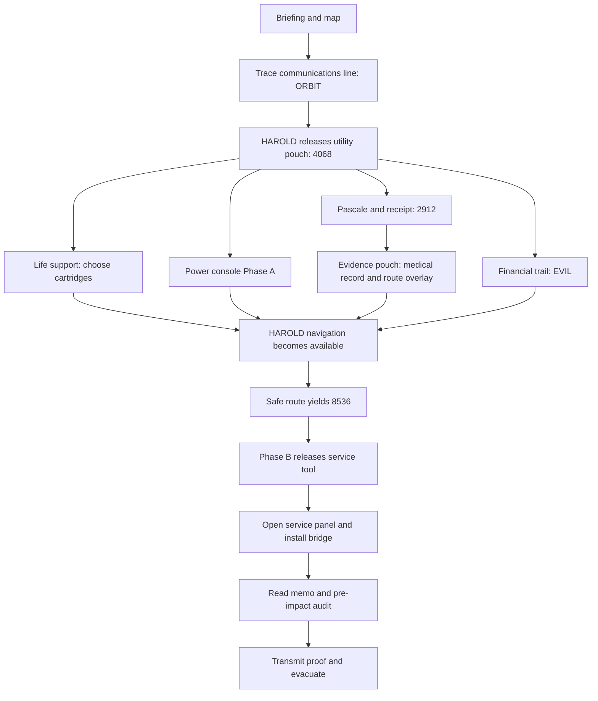

# Space Station Aurora completion proposal

**Recommendation:** build the hybrid version below: a printed station map, two locked pouches, a two-stage Arduino repair box, and HAROLD on one shared device. Prototype the entire game with paper envelopes before manufacturing the box.

This is a proposed design, not accepted canon or a finished game. Existing source files have not been changed. All new puzzle values, dialogue, dates, dimensions, and play targets below are design proposals. Target assumption: 2–4 adult/teen players, 60–90 minutes, one table, one backpack and one shared screen. Duration needs blind playtesting. Purchasing region, budget, owned hardware, printer capacity and player ages are unconfirmed.

## 1. Review of the existing project

The project already has a useful foundation: Sarah as the player, a real meteorite strike made worse by sabotage, Pascale's replacement, Alistair's gambling debt, E.V.I.L.'s payment, and a physical repair finale. The main missing work is connecting evidence and hardware into a fair sequence.

| Asset reviewed | Finding | Proposed action |
|---|---|---|
| `Aurora_Adventure_Bible.docx` | Provides the story, puzzle contracts and fairness rules. Several answers and dependencies remain proposed or undefined. | Use its causal story and parallel branches. Replace TBD steps with the contracts below. |
| `Aurora_Project_Tracker.xlsx` | Decision Log entries are still PROPOSED or NEEDS DECISION. | Review this proposal before updating accepted canon. |
| `Support_Design.pptx` | Strong crew, receipt and visual material. Conflicting crew facts and an empty electronic-puzzle slide. | Retain visual language; standardize facts and replace puzzle placeholders. |
| `Support_Excel.xlsx` | Two electronic configurations and 8536# already exist, but their clue sources do not. Shopping and wiring disagree on component counts. | Preserve both configurations; use three dials and two switches. Rebuild the board-specific wiring plan before assembly. |
| `Website_Harold.html` | Only ORBIT is implemented. Every repeated ORBIT increments the module count; five repetitions can trigger completion. No saved progress or full ending. | Replace the counter with individual completed states and enforce prerequisites. |
| `Station_BluePrint.dxf` | Contains basic geometry: 10 LINE entities, an ARC and a CIRCLE; no TEXT/MTEXT room labels or complete puzzle. | Create the map from an explicit connection list, then apply the station artwork. |
| Briefing, betting emails and E.V.I.L. memo documents | Briefing gives Pascale's absence. Betting correspondence has inconsistent sender/company labels. Memo has branding but no substantive proof text. | Use the revised prop content below. Inspect final exports for duplicated text boxes; extraction alone cannot establish visible duplication. |
| Design guides and image library | Consistent navy/orange identity is available. The guide's missing-vector-logo task appears stale: v7 SVG and 2048 PNG now exist. | Inspect/select those existing masters before commissioning another logo. |

**Specific fixes before printing**

- Receipt: $22.13 × 13.5% is $2.99 after rounding, not $6.99. A corrected receipt preserving **2912** is supplied below.
- Bank statement: February 27 transactions appear below February 19 in the displayed order. Fix transaction chronology and running balances together, or use the clearly labeled transaction extract below.
- Identity: a bank located in Waco does not prove the account holder was born there. Drop nationality as a required deduction. If retained, add a genuine conflicting personnel record; geography alone does not prove sabotage.
- Use Helena's proposed birth date **1977-12-30** consistently. Keep only Sarah, Helena, Alistair and Pascale in the main game.
- The tool must be obtainable before players need the memo behind its panel. The final evidence gate therefore follows tool recovery.
- The electronics list specifies logarithmic potentiometers, which are awkward for evenly spaced percentage dials. Use linear ones. The pin notes mix classic Nano assumptions with Nano Every; AREF is not a general-purpose output, and the Every has no DAC. Use its official pinout.

## 2. Three build options

| Option | Experience | What changes | Main tradeoff |
|---|---|---|---|
| **A. Paper and locks** | Same investigation and map; paper control panel; HAROLD validates settings | Phase A settings release a pouch code; Phase B uses a four-digit lock at 8536 | Fastest to build. Less physical repair feedback. |
| **B. Hybrid — recommended** | Printed map, tactile life-support cartridges, two-stage Arduino box, HAROLD | Full sequence below | Good variety and a convincing finale; needs hardware testing. |
| **C. Instrumented station** | Hybrid plus a magnetic station board, detected repair cartridge and direct hardware status | Add sensors and a managed connection after B works | More immersive, but more wiring, transport and reset failure points. |

Do not add extra puzzles merely to justify C. Give the same actions better feedback. The most valuable upgrade is detecting the final repair, not adding another cipher.

Alternative story tones: the recommended version retains the poisoning backstory with documentary evidence only. For a younger audience, replace it with falsified quarantine paperwork that removed Pascale from the flight; replace the allergen/receipt puzzle with a forged supply-order comparison. That is a separate rewrite, not a drop-in change to 2912.

## 3. Recommended sequence and packing



The two starting branches are physical repairs and investigation. Within them, players can divide the life-support/console work and medical/financial work. The map is shared, but only one puzzle needs it at a time.

| Location | Accessible when | Contents |
|---|---|---|
| Outer START sleeve | Immediately | Briefing, Sarah ID, station map, communications fault strip, HAROLD start card, pencil |
| Main backpack | Immediately | Locked utility pouch U, locked evidence pouch E, Arduino box, closed service panel |
| Utility pouch U, lock **4068** | HAROLD accepts ORBIT | Crew profiles; receipt; transaction extract; two betting messages; three life-support cartridge props and cradle; Phase A card; inventory sheet |
| Evidence pouch E, lock **2912** | Receipt solved | Medical follow-up M-26; replacement order R-25; transparent route overlay; evacuation procedure |
| Console drawer A | Phase A completed | Power acknowledgement **P806**, printed on a card retained in drawer until opened |
| Console drawer B | Phase B completed | Short service tool and inert bridge cartridge; tool tag |
| Service panel interior | Tool recovered | Memo EV-2702, audit SG-17, bridge mounting point; core acknowledgement **C742** beneath the cartridge flap |

The outer bag remains open so players can identify their goals. Label locks **UTILITY** and **PERSONAL RECORDS**, and label each answer destination on its clue. Pouches contain separate subsets of equipment because Alistair secured sensitive items in his working kit. The personal-records lock has a deliberately private mnemonic.

Use a reusable envelope for loose clues after solving. Inventory text tells players there are no clues in seams, batteries, screw threads or manufacturer's serial numbers.

## 4. Exact puzzles and clue content

### P0 — Briefing and first instruction

**Player-facing briefing:**

> Station Aurora — emergency handover — 02 March 2032
>
> You are Dr. Sarah Lancaster, biologist and physician. A micrometeorite strike has damaged Aurora. Commander Helena Chen and engineer Alistair Johnson are sealed in the crew quarters. You have reached Johnson's emergency backpack.
>
> Restore internal communications, stabilize the station, then prepare evacuation. The kit contains secured repair equipment. HAROLD will track your progress.
>
> Pascale Tremblay, the original engineer, missed launch after an anaphylactic reaction. Her condition is improving.
>
> START: match the communications fault strip to the station map. Find the surviving signal path.

On the HAROLD card: **“Use the prepared station terminal. Type the five-letter recovery word. You do not need a personal account.”** A working URL/QR belongs on this card only after a deployment destination is chosen. Do not print a placeholder URL as if it works.

Rules card: open only unfastened compartments; use tools only on labeled fittings; nothing requires force; all food/medical items are fictional props. Allergen packaging is printed and empty.

### P1 — Restore communications with the station map

**Inputs:** map and fault strip, both in START. **Method:** trace a single surviving communications cable. **Answer:** ORBIT. **Unlock:** communications state; HAROLD gives **4068** for pouch U. This released number is a reward, not an additional puzzle.

Map specification: a 5×5 coordinate grid, columns A–E left to right, rows 1–5 top to bottom. Print a north arrow and an explicit legend. Relevant modules:

| Coordinate | Module | Communications tag | Evacuation hatch digit |
|---|---|---|---|
| A1 | Docking | O | — |
| B1 | Storage | R | — |
| C1 | Science annex | X | — |
| B2 | Engineering | B | — |
| C2 | Cupola | I | — |
| D2 | Hydroponics | Z | — |
| C3 | Bridge | T | 2 |
| D3 | Crew quarters | — | START |
| D4 | Medical bay | — | 8 |
| C4 | Transfer hub | — | 5 |
| B4 | Suit locker | — | 3 |
| B5 | Evacuation dock | — | 6 |

Unused cells are hull/background, not implied rooms. Use **Cupola**, correcting the draft's “Copula.” This is a proposed replacement layout rather than a claim about the DXF.

Print communications connections as dashed lines: **A1–B1, B1–B2, B2–C2, C2–C3, B1–C1, C2–D2**. Do not add other dashed connections. Ordinary corridors use solid lines and are a separate network.

**Fault strip:**

> COMMUNICATIONS CABLE TEST
> B1–C1: OPEN CIRCUIT
> C2–D2: OPEN CIRCUIT
> Cross out those cable links. Starting at Docking A1, follow the intact dashed cable to Bridge C3. Read each module's communications tag, including the start and finish. Ignore solid walking corridors.

Remaining path: A1 → B1 → B2 → C2 → C3 = **O R B I T**.

**HAROLD response:** “Internal communications restored. Utility pouch override: 4068. Open the pouch. Life support and auxiliary power need manual repair. Medical and financial records may explain the abnormal safeguard failures.”

**Hints:** 1. Use dashed cables. 2. Remove the two links named on the strip. 3. Follow A1, B1, B2, C2, C3: ORBIT.

### P2 — Stabilize life support with physical cartridges

**Inputs:** three card-wrapped wooden/printed blocks and a two-slot cradle from U. **Method:** select a pair satisfying capacity and rack limits. **Answer:** **L12**, read from the installed blocks. **Unlock:** life support in HAROLD.

These are fictional scrubber-capacity units, not instructions for real atmospheric equipment.

| Cartridge | Capacity | Rack load | Back label |
|---|---:|---:|---|
| A | 4 | 2 | L |
| B | 6 | 4 | X |
| C | 8 | 3 | 12 |

**Cradle label:** “Install exactly TWO cartridges. Required capacity: exactly 12 units. Maximum combined rack load: 5. Place the lower-capacity cartridge in the LEFT slot. Read the back labels left to right and report the service acknowledgement to HAROLD.”

Only A+C works: 4+8=12, 2+3=5. Other pairs produce 10 or 14 capacity. Slots expose the backs after insertion. All three blocks should fit either slot so physical fit does not give away selection.

**HAROLD:** “LIFE SUPPORT STABLE. Crew atmosphere protected. Auxiliary power and investigation remain available.”

**Hints:** 1. Both totals matter. 2. Find a pair totaling 12. 3. A+C, smaller first, gives L12.

### P3 — Auxiliary power on the Arduino box

**Inputs:** Phase A procedure in U; box visible from start. **Method:** derive three percentages, set two switches. **Preserves the existing 80/20/60 configuration.**

Front labels: **SW1 AUXILIARY**, **SW2 MAIN BUS**, and dials **RESERVE**, **STANDBY**, **COOLING**, each marked 0–100 with clear 20-unit ticks. Give every switch a printed ON/OFF position.

**Phase A procedure:**

> AUXILIARY START
> Enable AUXILIARY. Isolate MAIN BUS.
> RESERVE: allocate what remains from 100 after science takes 20.
> STANDBY: set to one fifth of full scale.
> COOLING: three active loops require 20 each. Set their total.
> These are independent controls, not shares of one combined budget. Press # to test.

**Solution:** SW1 ON; SW2 OFF; dials **80,20,60**. Correct settings release drawer A. Card reads **“Auxiliary bus stable. Report P806 to HAROLD.”**

Show persistent green success and a brief three-blink animation. Drawer stays released until facilitator reset; avoid the draft's four-second re-lock window. Wrong settings give amber feedback without erasing progress.

**Hints:** 1. Solve each dial independently. 2. Use 100−20, 100÷5, and 3×20. 3. ON/OFF, 80/20/60, then #.

### P4 — Pascale's replacement and the receipt

**Inputs:** crew profiles, briefing and receipt in U. **Method:** identify the absent engineer, match the purchases to her recorded allergies, use the explicitly clued receipt total. **Answer:** **2912**. **Unlock:** personal-records pouch E.

Crew profile fields required for this puzzle:

| Person | Role | Relevant fact |
|---|---|---|
| Sarah Lancaster | Biologist/physician | Allergies: tree pollen; active player |
| Helena Chen | Commander/pilot | Allergies: none |
| Alistair Johnson | Replacement engineer/comms | Allergies: pet dander |
| Pascale Tremblay | Original engineer/comms | Allergies: peanuts and shellfish; absent after reaction |

Pouch mnemonic, styled as Alistair's private reminder: **“The shopping that got me aboard. Whole receipt total, four digits. Ignore the decimal.”** This deliberately adds suspicion; the final memo still establishes intent.

**Corrected receipt content:**

```text
FISH AND NUTS
24 FEB 2032  21:47
Customer: A. Johnson
Peanuts                         2.00
Walnuts                         2.63
Shellfish product              17.50
Packing service                 3.53
SUBTOTAL                       25.66
TAX 13.5%                       3.46
TOTAL                          29.12
```

The service charge preserves the existing code with correct arithmetic. The tax rate is fictional worldbuilding. A cleaner alternative is a 2512 code using the original subtotal and corrected tax; that would require changing every lock reference. Recommended: retain 2912.

Inside E, print:

> M-26 — Medical follow-up, 26 February 2032. Pascale Tremblay experienced an anaphylactic reaction on 25 February. She is recovering but cannot join this launch. This record establishes the event; it does not identify who caused it.

> R-25 — Crew replacement order, 25 February 2032. Engineering post reassigned from Pascale Tremblay to Alistair Johnson, staff ID 573302.

HAROLD's investigation screen asks: **“Who was replaced?”** Accept Pascale/Tremblay/Pascale Tremblay, then **“Enter the follow-up record ID found inside personal records.”** Accept M26/M-26. The mnemonic and purchase are suspicious, not sufficient proof of deliberate exposure.

**Hints:** 1. Compare the absent engineer's allergies with the receipt. 2. Use the whole total, not just two ingredients. 3. 29.12 becomes 2912; open E and report M-26.

### P5 — Follow the money

**Inputs:** shortened bank transaction extract and two betting messages in U. **Method:** distinguish payments out from the unusual corporate credit. **Answer:** **EVIL**. **Unlock:** sponsor identified; HAROLD records the payment reference.

Print a **selected transaction extract**, not a complete statement with unsupported balances. Preserve the draft's million-dollar payment and scale of gambling, but simplify the displayed evidence:

| Date | Description | Money in | Money out | Reference |
|---|---|---:|---:|---|
| 13 Feb 2032 | Betting Only Online | — | 210,000.00 | BOO-13 |
| 20 Feb 2032 | Stakes and Punts | — | 150,000.00 | SAP-20 |
| 21 Feb 2032 | Stakes and Punts | — | 200,000.00 | SAP-21 |
| 24 Feb 2032 | Fish and Nuts | — | 29.12 | FN-24 |
| 27 Feb 2032 | Earth Vehicle Interstellar Landers | 1,000,000.00 | — | EV-2702 |
| 28 Feb 2032 | Stakes and Punts | — | 100,000.00 | SAP-28 |

Header: “B.A.D. — Bank of American Deposits. Account holder: Alistair Johnson. Selected transaction extract; not a full balance statement.” These revised dates/rows must replace, rather than coexist with, contradictory old printouts.

**Message 1:** “14 February. Betting Only Online to Alistair Johnson: Your account remains suspended following the recent losses. No further deposits will be accepted.”

**Message 2:** “28 February. Stakes and Punts to Alistair Johnson: We have received your updated funding document and processed your 100,000.00 deposit.”

Use fictional `.example` addresses in new props rather than real BOO/SAP websites.

**HAROLD prompt:** “Which external organization paid Johnson? Enter its initials, then the payment reference.” Accept **EVIL**, **E.V.I.L.** or the full name; then **EV-2702** or **EV2702**.

Response: “Sponsor identified. Payment alone does not prove sabotage. Recover a matching instruction and station audit.”

**Hints:** 1. Compare Money in and Money out. 2. Find the corporate credit. 3. Earth Vehicle Interstellar Landers = EVIL; reference EV-2702.

### P6 — Plan the safe route and derive 8536

**Available only when:** life support L12, power P806, medical M-26 and sponsor EV-2702 are recorded. **Inputs:** map, route overlay from E, HAROLD damage update. **Method:** eliminate a blocked route and read hatch digits in walking order. **Answer:** **8536**. **Unlock:** navigation restored; the final console procedure appears.

Draw solid walking corridors exactly as follows: **D3–C3, C3–C4, D3–D4, D4–C4, C4–B4, B4–B5**. Keep these visually distinct from communications cables. Other decorative station connections must be visibly labeled outside the emergency route network.

Overlay has a TOP marker and alignment crosses at A1/E5. Label it **EVACUATION ROUTES — SOLID CORRIDORS ONLY**. Its clear windows identify D3 as start and B5 as finish. It also carries the extraction instruction below, so opening E contributes a physical navigation resource.

**HAROLD update:** “D3–C3 corridor sealed by impact. Start at Crew Quarters D3. Reach Evacuation Dock B5 using solid corridors. Never cross a sealed corridor. Read the digit of each room entered; skip START and include the destination.”

Unique simple route: **D3 → D4 → C4 → B4 → B5**, digits **8 5 3 6**. The open spur C4–C3 is a dead end after the seal; instruct players not to revisit rooms.

**HAROLD response to 8536:** “Navigation restored. Crew route verified. Console Phase B authorized. Apply the complement procedure and enter the route code on the physical keypad.”

This is the second use of the map, with a different operation and a different kind of connection. It does not require guessing that north means up or that adjacent squares imply corridors.

**Hints:** 1. Block D3–C3; use solid corridors. 2. Begin D3→D4 and do not revisit a room. 3. D4,C4,B4,B5 gives 8536.

### P7 — Console Phase B releases the tool

**Inputs:** completed Phase A; HAROLD complement procedure; route code. **Method:** reverse switches and complement each original dial setting. **Output:** drawer B opens.

**Procedure:** “Transfer to main bus. Reverse both switch positions from AUXILIARY START. Set every dial to 100 minus its original Phase A value. Enter the evacuation route code followed by #.”

**Solution:** SW1 OFF; SW2 ON; **20,80,40**; keypad **8536#**. Firmware must require Phase A already complete. Place the procedure on HAROLD only after the navigation gate.

Drawer B contains a short hex tool and an inert bridge cartridge. Tag: **“Open CORE SERVICE panel with this tool. Install the bridge on matching contacts X2–X3, arrow toward RESTORE. Lift its verification flap after fitting and report the acknowledgement.”**

**Hints:** 1. Use the original Phase A values. 2. Subtract each from 100 and reverse both switches. 3. OFF/ON, 20/80/40, then 8536#.

### P8 — Physical repair and decisive evidence

**Inputs:** tool, bridge cartridge, service panel. **Action:** undo one captive hex fastener, open the panel, fit the keyed cartridge and lift its flap. **Output:** core acknowledgement **C742**, memo and audit become available. This is a tactile payoff, not another arithmetic puzzle.

Use a decorative printed circuit with inert contacts. In B, the app accepts the reported acknowledgement; it does not claim to sense the cartridge. C can add a microswitch to verify insertion. Align the cartridge with a keyed recess so the correct orientation is obvious.

**Memo EV-2702 — proposed full text:**

> Earth Vehicle Interstellar Landers
> Restricted project correspondence — 27 February 2032
> To: Alistair Johnson, engineering credential 573302
> Re: Aurora replacement programme / EV-2702
>
> Your confirmation that Tremblay's allergic reaction removed her from the launch roster has been received. The agreed transfer of 1,000,000.00 has been released under reference EV-2702.
>
> Proceed with work order SG-17: disable Aurora's automatic impact-isolation safeguards before the next operational watch. Routine debris damage must result in a station withdrawal. Our replacement-station bid depends on Aurora being declared unserviceable.
>
> Retain the manual restoration bridge in your secured toolkit. Keep this instruction off the station network and destroy it after the withdrawal order.
>
> Programme Office — E.V.I.L.

**Audit SG-17 — proposed full text:**

> Aurora local maintenance recorder — protected copy
> 01 March 2032, 22:10 — Credential 573302 manually sets automatic impact isolation to DISABLED. Work order SG-17. No fault condition recorded.
> 02 March 2032, 02:14 — Micrometeorite impacts detected.
> 02 March 2032, 02:14 — Automatic isolation unavailable. Damage propagates beyond initial impact modules.

These records establish instruction, matching payment, credential and pre-impact action. The stored memo is Alistair's retained payment leverage, explaining why he kept a copy despite the destruction instruction. The final reveal confirms the genuine impact was exploited, not engineered.

**Hints:** 1. Use the recovered tool only on CORE SERVICE. 2. Match X2–X3 and the arrow. 3. Fit the bridge, lift its flap and enter C742; keep both records for transmission.

### P9 — Transmit proof and evacuate

**Inputs:** bank extract, memo, audit and crew ID. **Method:** complete a structured incident report with cross-matched evidence. **Output:** evidence transmitted, then evacuation confirmed.

HAROLD provides an emergency protocol card in the report screen: **01 impact, 02 fire, 03 deliberate sabotage**. The final report selects **03** and asks for:

| Field | Accepted answer | Evidence |
|---|---|---|
| Responsible engineer | Alistair Johnson | Memo and credential lookup |
| Sponsor | EVIL / full corporate name | Memo and bank credit |
| Payment reference | EV-2702 | Both matching documents |
| Work order | SG-17 | Memo and audit |
| Credential | 573302 | Alistair ID and audit |
| Disabled system | Automatic impact isolation | Memo and audit |
| Relative timing | Before impact | Audit timestamps |

Use choices for the final system/timing fields and short normalized inputs for IDs. No essay grading or live AI needed. Incorrect answers identify the field to recheck without wiping the report.

All five system states must be complete before **TRANSMIT EVIDENCE** becomes available. After a valid report, show **“Evidence received by mission control. Corporate instruction and pre-impact sabotage matched.”** Then enable **INITIATE EVACUATION**.

Ending: **“Sarah, Helena and Alistair have reached the evacuation craft. Alistair's access has been revoked and mission control will arrange custody on arrival. Pascale remains safe on Earth. Aurora is stabilized pending investigation. E.V.I.L.'s instructions and payment records are preserved.”**

**Hints:** 1. Look for IDs repeated across records. 2. Match EV-2702 and SG-17, then compare timestamps. 3. Protocol 03; Johnson / EVIL / EV-2702 / SG-17 / 573302 / automatic impact isolation / before impact.

## 5. HAROLD as an interface

Use a deterministic character interface. A live chatbot adds cost and unpredictable hints without improving these puzzle mechanics.

Recommended screen: current objective at top; large station map in the centre; five system statuses; **Inspect documents**, **Enter result**, and **Hint** actions. Provide a separate evidence checklist. Use the established navy, white and emergency orange, with readable body text; Orbitron suits headings more than paragraphs.

| Event | State change | Next visible action |
|---|---|---|
| ORBIT | Communications complete | Pouch U override and four tasks |
| L12 | Life support complete | Remaining tasks |
| P806 | Power complete | Remaining tasks |
| Pascale + M-26 | Medical evidence recorded | Remaining tasks |
| EVIL + EV-2702 | Sponsor recorded | Remaining tasks |
| All four post-comms tasks done | Navigation challenge enabled | Damage update and safe-route instruction |
| 8536 | Navigation complete | Phase B instructions |
| C742, after navigation | Core complete | Evidence report |
| Valid report, five systems complete | Evidence sent | Evacuate button |
| Evacuate button | Mission complete | Ending and elapsed time |

Implementation priorities:

1. Store each completed system once; derive the count from those states. Repeated answers return “Already restored.”
2. Enforce prerequisites. An answer entered early should say which task is pending, not activate a later system.
3. Save progress, elapsed active time and hints. Offer a deliberate facilitator reset and recovery after refresh. Validate storage behaviour on the actual device and browser.
4. Use a shared offline-capable device with all assets available locally. The existing external font request should have a local/system fallback. Provide printed HAROLD response cards for a full no-device fallback.
5. Make important instructions permanently readable. Corruption can affect introductory flavour or decorative telemetry, never required clue characters. HAROLD becomes clearer as repairs succeed.
6. Use text with every sound/colour signal, large controls, no flashing required to solve, and an optional timer. Start with elapsed time; only add a failure countdown after pacing tests.
7. Provide one three-step hint ladder per puzzle, as written above. Keep the exact answer behind the third hint.

**Physical/digital limitation:** B uses manually entered acknowledgement codes. The browser cannot know that a servo moved or a cartridge was fitted. This is sufficient for cooperative play, with no need for radio pairing. Strict physical prerequisite enforcement belongs in C via a tested wired host connection or sensors. Client-side answers are also inspectable; this is an experience, not a security system.

**Map alternatives**

- **Printed map + digital damage updates — recommended:** easy to share, tactile marking and minimal hardware.
- **Interactive screen map:** click a room to read logs or highlight damage. Useful for a small table, but risks one player owning the screen. Duplicate the map on paper.
- **Magnetic board:** move a crew token along the route and place a bridge token in Engineering. For C, use individually identified positions or keyed pieces. A reed switch detects a magnet, not which room-token it is.

**QR alternative:** reconstruct a cut-up maintenance label to recover a local message or recovery word. Use it instead of P1 if desired, rather than adding another opening gate. Printed alignment marks make assembly meaningful; a QR's error correction can allow scanning before assembly is complete. Keep a readable recovery word beneath the completed label. A QR alone does not restore an offline connection, so keep HAROLD pre-opened on the supplied device.

## 6. Arduino box proposal

**Suggested enclosure:** approximately **160 × 110 × 65 mm**, with a removable front control plate, three knobs, two switches, a membrane keypad and two small pull-out drawers. This is a packaging target, not verified CAD. Measure actual keypad, knob sweep, servo horns, connectors and service tool before freezing dimensions.

Separate the electronics cavity from player drawers. Put captive panel fasteners and a facilitator-only mechanical release underneath. Use rounded corners and strain relief at USB entry. Trial walls around 2.4–3 mm and printed clearances around 0.3–0.5 mm per mating side are starting points to test on the actual printer. Fit coupons should precede the full shell. Use PLA for indoor prototypes or PETG if transport heat is a concern.

**Mechanism:** each servo rotates a light latch clear of its drawer. The latch carries minimal load; the servo should not hold a drawer closed against tension. Drawers stay unlocked until reset. Add a travel stop and an accessible manual release. Do not depend on forcing a jammed servo.

**Proposed Nano Every pin allocation** — a fresh plan, not the current workbook wiring:

| Function | Pins |
|---|---|
| Three linear dial wipers | A0, A1, A2 |
| Auxiliary and main switches | A3, D12; switch to GND using input pull-ups |
| 3×4 keypad | D2–D8 |
| Drawer servos | D9, D10 signal |
| Amber and green indicators | D11, D13 through individual current-limiting resistors |
| Reserved | A4/A5 for potential I²C; D0/D1 for serial; A6/A7 unassigned |

Arduino's published Nano Every documentation specifies 5 V operation, eight analog inputs and PWM rather than a DAC. Confirm this mapping and library compatibility on the chosen board before soldering. [Arduino Nano Every specifications](https://store.arduino.cc/products/nano-every), [official pinout](https://docs.arduino.cc/resources/pinouts/ABX00028-full-pinout.pdf).

Power the controller through its documented USB input. Supply servos from an appropriate regulated supply branch, with common ground and decoupling, rather than from signal pins. Avoid backfeeding between USB and a separate rail. Final current capacity depends on actual servo startup/stall measurements. Test a power bank for low-load shutdown over a complete session; it is not guaranteed to stay on. Adafruit documents servo-induced resets and bulk capacitance as a mitigation, not a substitute for adequate power. [Servo power troubleshooting](https://learn.adafruit.com/adafruit-arduino-lesson-14-servo-motors/if-the-servo-misbehaves).

**Firmware behaviour:** calibrate dial endpoints; use an initial ±5 percentage-point acceptance band, stable for 0.5 seconds before # validates. These tolerances are proposed and need usability testing. Phase A clears the keypad buffer and latches its success. Phase B checks its settings and 8536#. `*` clears an entry. Wrong attempts never relock an already released drawer. Save stage changes only when they occur; allow facilitator reset. Power restoration should restore the previously completed stage safely.

**Simpler box alternatives:**

- One drawer and one servo, with Phase A acknowledged by a light and code label behind a manual flap. Smaller and easier to service, but weakens the first physical reward.
- Three rotary selector switches instead of potentiometers, with discrete 0/20/40/60/80/100 settings. Less calibration trouble; requires a revised electrical design.
- Paper dials and HAROLD validation for option A. Have HAROLD accept ON/OFF/80/20/60 and reveal **6204** for drawer-A substitute pouch; its card still reads P806. Use **8536** on the tool pouch after the Phase B screen validates OFF/ON/20/80/40. Cooperative play is assumed because the physical lock itself cannot verify dial positions.

## 7. Shopping list

Buy only enough for a cardboard prototype first. Product links below were checked during this review; they establish commercially listed examples, not local stock, delivered prices or compatibility. No total budget is quoted because destination, existing inventory and exact components are unknown.

| Qty | Item | Purpose and selection guidance |
|---:|---|---|
| 1 | Existing backpack or tool backpack | Reuse a bag first. Commercial example: [Klein Tradesman Pro 55421BP-14](https://www.kleintools.com/catalog/tool-backpacks/tradesman-pro-tool-bag-backpack-39-pockets-black-14-inch). Check packed weight and usable internal space. |
| 1 | Utility organizer | [Maxpedition Beefy](https://www.maxpedition.com/collections/edc-everyday-carry/products/beefy-pocket-organizer) is a clamshell example, listed as 6 × 2.5 × 8 inches. Use it for clues/tools, not as a guaranteed fit for the proposed console. |
| 1 | Smaller opaque document pouch | Personal-records pouch E. Two lockable pulls or an added fabric closure with metal eyelets. |
| 2 | Resettable four-digit locks | U=4068 and E=2912. [Master Lock 4696D](https://www.masterlock.com/products/product/4696D) is a verified four-dial example. Its 6 mm shackle may not fit zipper holes; test with the actual pouch or use a purpose-made eyelet tab. |
| 2 extra for A | Four-digit locks and substitute pouches | Phase A reward 6204 and tool pouch 8536. Not required for B. |
| 3 | Small wooden blocks or printed cartridges | Life support; no liquid or real consumables. |
| 1 set | Printed cradle and service-panel frame | Cardboard first, then 3D print or simple sheet material. |
| 1 | Short hex key or stubby driver plus matching captive fastener | Final repair. Choose the fastener after measuring the drawer/tool. |
| 1 | Arduino Nano Every with headers | [Official board listing](https://store.arduino.cc/products/nano-every). Confirm which variant is already owned. |
| 3 | 10 kΩ linear potentiometers and three pointer knobs | Example: [Adafruit 562](https://www.adafruit.com/product/562). Match knob bore to shaft and allow nut clearance. |
| 2 | Small two-position SPST switches | Auxiliary and main; clearly marked positions. Only low-voltage signals in this prop. |
| 1 | 3×4 keypad | Example: [Adafruit 419](https://www.adafruit.com/product/419). Check tail routing and panel footprint. |
| 2 | Positional micro servos | Example: [Adafruit SG92R, product 169](https://www.adafruit.com/product/169). Select latch geometry and supply against actual servo specifications. |
| 2 | LEDs with individual resistors | Green and amber, with text equivalents. |
| 1 set | Solderable board, connectors, wire, heat-shrink, bulk capacitors, fasteners | Secure joints and strain relief; the draft's shopping prices are not a current quote. |
| 1 | Suitable USB supply or tested power bank and cables | Final power plan follows measured load. |
| 1 set | Cardstock, matte paper, clear printable film, sleeves and removable labels | Map, cards, evidence and overlays. Confirm film is suitable for the actual printer. |
| Optional | Inspection mirror or UV flashlight/ink | Only buy if replacing a clue with a reflection/inspection puzzle. Adding an unused gadget makes players search for nonexistent clues. |

The recommended base needs **two mechanical locks, two servo releases and one tool-operated panel**. This offers varied interactions without filling the backpack with unrelated locks.

## 8. Printout production manifest

All player-facing content is specified above; the following defines the production exports. These printouts have not yet been laid out or physically tested.

| Print asset | Suggested format | Placement |
|---|---|---|
| Emergency briefing + rules | One Letter/A4 sheet, readable body type | START |
| Sarah ID | Wallet-size card | START |
| Station map | A3/11×17, or two aligned Letter/A4 pages | START; folds once for transport |
| Communications fault strip | Narrow card | START |
| HAROLD launch card | A6/quarter sheet; deployed QR only when verified | START |
| Crew profiles | One sheet or four consistent cards | U |
| Fish and Nuts receipt | Approximately 80 mm wide | U |
| Bank transaction extract | One sheet | U |
| Two betting messages | One combined sheet | U |
| Phase A procedure | Durable A6/quarter sheet | U |
| Cartridge labels and cradle instruction | Labels plus one card | U |
| M-26 medical and R-25 replacement record | Two short cards | E |
| Route overlay and evacuation instruction | Transparent sheet matching map scale, fold registration indicated | E |
| P806 acknowledgement | Small card | Drawer A |
| Tool tag and bridge labels | Small card and adhesive labels | Drawer B |
| Memo EV-2702 | One corporate sheet | Service panel |
| Audit SG-17 | Narrow recorder-style strip | Service panel |
| C742 acknowledgement | Under cartridge verification flap | Service panel |
| HAROLD fallback responses and hints | Facilitator-only booklet/cards | Outside player kit |
| Reset manifest | One checklist with packing photo | Facilitator kit |

Use Aurora/MAPLE styling for official props, restrained bank styling for financial evidence, and a distinct E.V.I.L. letterhead. Preserve the project's navy #16253C and orange #A84420. Use regular readable body type; reserve display fonts for short labels. Critical information must survive a grayscale print. Test overlays at 100% scale; disable fit-to-page.

## 9. Completion plan and acceptance checks

| Stage | Deliverable | Completion check |
|---|---|---|
| 1. Freeze the design | Accepted cast, story, exact answers, chosen option | No TBD output; medical/financial dates match; source tracker updated after decisions |
| 2. Paper prototype | Plain printed clues, envelopes standing in for every release | Someone unfamiliar with the project can reach the ending without designer explanation |
| 3. Build HAROLD | Five systems, evidence form, hints, saved state, ending | Early/repeated codes cannot skip stages; refresh and recovery tested |
| 4. Bench prototype | Actual switches/dials/keypad and two latches | Every valid configuration works; near-miss settings do not; power cycle and manual release work |
| 5. Prop production | Final map, print pack, fitted enclosure and packed bag | No clipped text, ambiguous lines, unreadable IDs or exposed later clues |
| 6. Blind playtests | Tracker records observations and revisions | Players understand next actions; every recurring confusion has a fix or deliberate hint |
| 7. Release kit | Master answer list, reset guide, spare clues and fallback | A second facilitator can reset and run it without the designer |

Suggested test targets, not measured results: a complete 60–90-minute play window; reset under 10 minutes; at least 20 consecutive console release/reset cycles; at least three independent groups before a public version. Adjust duration based on observed time per puzzle and player idle time, not an arbitrary difficulty rating.

Check deliberately: five ORBIT submissions; 8536 entered before prerequisites; wrong record IDs; case/punctuation variations; refresh midgame; loss of power after each drawer release; mute mode; a jammed drawer; a missing overlay; and a fully offline run. Mechanical failures should have a facilitator bypass that preserves solved progress.

**Reset order:** remove the service tool and bridge; re-pack memo/audit; close service panel and verification flap; place tool/bridge in drawer B and P806 in A; reset console and verify both latches; repack E and lock at 2912; repack U and lock at 4068; scramble locks; return START items; restore all three life-support cartridges; clear map markings; reset HAROLD; test supply; compare with the packing photo. Keep a spare printed clue set outside the bag.

## 10. Decisions worth making next

1. Choose A, B or C. Recommendation: **B**, prototyped as A.
2. Confirm audience, duration and whether the allergen backstory suits them.
3. Confirm a supplied HAROLD device versus player phones. Recommendation: **one supplied, preloaded device**.
4. Confirm which bag, Arduino parts and printer are already available before buying.
5. Accept the revised clue chain before commissioning final map artwork or enclosure CAD.

Review method: extracted text/tables from the project documents, decks and spreadsheets; inspected HAROLD source and DXF entity structure; checked manufacturer documentation for example purchases and board capabilities; traced proposed puzzle dependencies and arithmetic. Existing document page layouts, physical items, electronic firmware and deployed website behaviour were not tested. This proposal supplies a complete recommended design, with simpler and more elaborate build variants; it does not claim those implementations already exist.
